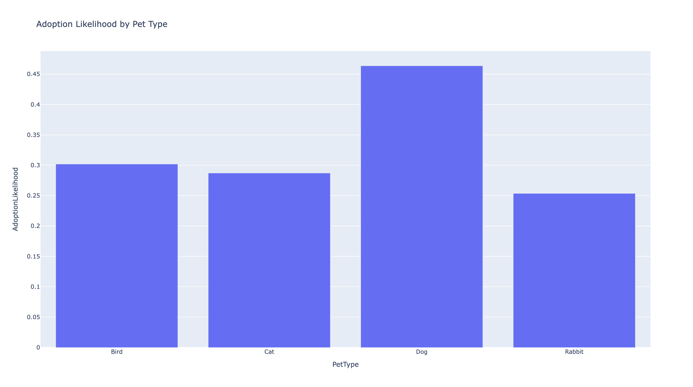
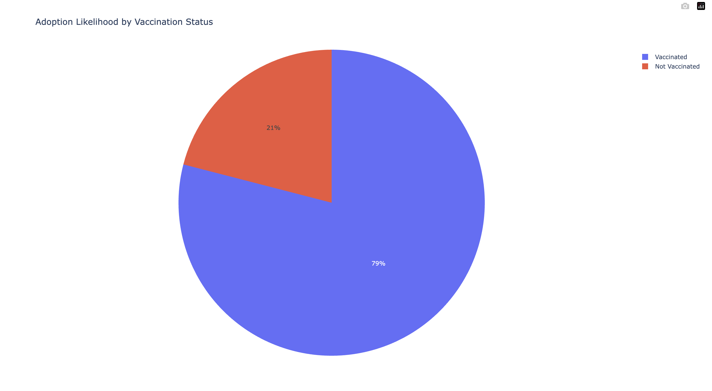
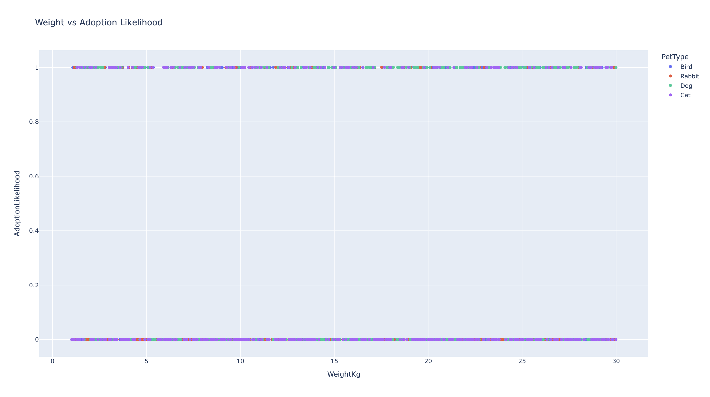
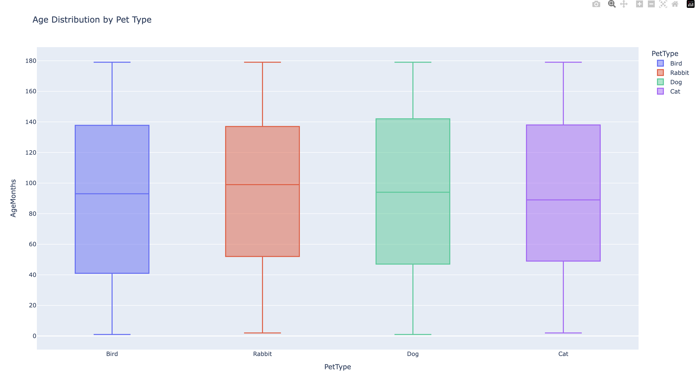
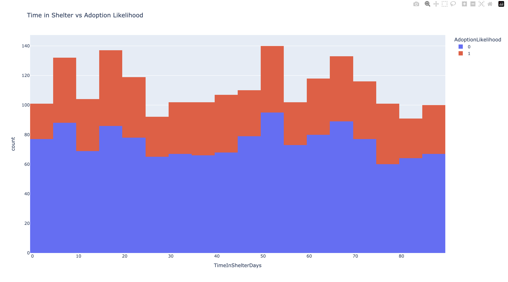
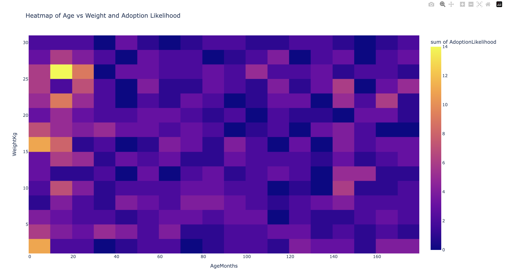

# FureverData

Exploring pet adoption trends through data visualization, inspired by my journey with my adopted pets—Luna, my service dog, and Tiffany, my emotional support cat. This project analyzes factors influencing adoption rates and aims to promote the positive impact of pet adoption.

## Overview

**FureverData** is a solo project that focuses on predicting the likelihood of pets being adopted based on several factors like age, weight, health condition, vaccination status, and more. By analyzing a dataset of animals available for adoption, the aim is to provide insights into which factors most influence adoption decisions and help shelters and agencies increase adoption rates.

In addition to exploratory visualizations, a basic machine learning model is implemented to predict adoption likelihood and identify the most influential factors.

## Findings and Visualizations

### 1. Adoption Likelihood by Pet Type

 **Insight** : Dogs have the highest likelihood of adoption among the different pet types, while rabbits are less likely to be adopted. This trend suggests that dogs' popularity as pets may make them more desirable for adopters.

### 2. Adoption Likelihood by Vaccination Status

 **Insight** : Vaccinated pets are significantly more likely to be adopted, with 79% of the likelihood attributed to vaccinated animals. This indicates that vaccination can be a critical factor in an adopter's decision-making process.

### 3. Weight vs. Adoption Likelihood

 **Insight** : The scatter plot suggests that there is a slight variation in adoption likelihood based on a pet's weight, with no extreme weight ranges correlating with a higher adoption probability. However, this relationship may vary with pet type.

### 4. Age Distribution by Pet Type

 **Insight** : The age distribution box plot shows that pets like birds have a wider age range, while rabbits tend to be younger. Understanding age demographics helps shelters highlight younger or older pets depending on adopters' preferences.

### 5. Time in Shelter vs. Adoption Likelihood

 **Insight** : Pets with a longer stay in shelters tend to have a lower likelihood of adoption. The histogram emphasizes the importance of finding new ways to market pets that have been in shelters for extended periods.

### 6. Heatmap of Age vs. Weight and Adoption Likelihood

 **Insight** : The heatmap reveals clusters of age and weight combinations that have higher adoption likelihoods. This can help in tailoring adoption drives for specific age and weight groups that are more likely to find homes.

## Features

The project includes:

* **Data visualizations** to explore various pet attributes (weight, pet type, vaccination status) in relation to adoption likelihood.
* **Interactive dashboards** powered by Flask and Plotly for users to explore data visually.
* **Machine learning model** predicting the adoption likelihood based on pet characteristics.

## Tech Stack

* **Python** : For data manipulation, analysis, and visualizations using Pandas, Matplotlib, and Plotly.
* **Flask** : Used as the backend framework to serve the web application.
* **SQLite** : Stores pet adoption data.
* **Scikit-learn** : Employed for the machine learning model predicting adoption likelihood.

## How to Use

### Requirements

To run the project, you'll need the following:

* Python 3.x
* Flask
* Pandas
* Matplotlib
* Plotly
* Scikit-learn
* SQLite3

Install the required packages:

<pre class="!overflow-visible">

bash

<button class="flex gap-1 items-center py-1"><svg width="24" height="24" viewBox="0 0 24 24" fill="none" xmlns="http://www.w3.org/2000/svg" class="icon-sm"><path fill-rule="evenodd" clip-rule="evenodd" d="M7 5C7 3.34315 8.34315 2 10 2H19C20.6569 2 22 3.34315 22 5V14C22 15.6569 20.6569 17 19 17H17V19C17 20.6569 15.6569 22 14 22H5C3.34315 22 2 20.6569 2 19V10C2 8.34315 3.34315 7 5 7H7V5ZM9 7H14C15.6569 7 17 8.34315 17 10V15H19C19.5523 15 20 14.5523 20 14V5C20 4.44772 19.5523 4 19 4H10C9.44772 4 9 4.44772 9 5V7ZM5 9C4.44772 9 4 9.44772 4 10V19C4 19.5523 4.44772 20 5 20H14C14.5523 20 15 19.5523 15 19V10C15 9.44772 14.5523 9 14 9H5Z" fill="currentColor"></path></svg>Copy code</button>

<code class="!whitespace-pre hljs language-bash">pip install -r requirements.txt
</code>

</pre>

### Running the Application

To start the application locally, navigate to the project directory and run:

<pre class="!overflow-visible">

bash

<button class="flex gap-1 items-center py-1"><svg width="24" height="24" viewBox="0 0 24 24" fill="none" xmlns="http://www.w3.org/2000/svg" class="icon-sm"><path fill-rule="evenodd" clip-rule="evenodd" d="M7 5C7 3.34315 8.34315 2 10 2H19C20.6569 2 22 3.34315 22 5V14C22 15.6569 20.6569 17 19 17H17V19C17 20.6569 15.6569 22 14 22H5C3.34315 22 2 20.6569 2 19V10C2 8.34315 3.34315 7 5 7H7V5ZM9 7H14C15.6569 7 17 8.34315 17 10V15H19C19.5523 15 20 14.5523 20 14V5C20 4.44772 19.5523 4 19 4H10C9.44772 4 9 4.44772 9 5V7ZM5 9C4.44772 9 4 9.44772 4 10V19C4 19.5523 4.44772 20 5 20H14C14.5523 20 15 19.5523 15 19V10C15 9.44772 14.5523 9 14 9H5Z" fill="currentColor"></path></svg>Copy code</button>

<code class="!whitespace-pre hljs language-bash">python app.py
</code>

</pre>

Visit `http://127.0.0.1:5000` in your browser to interact with the visualizations.

## Optimizing Adoption Likelihood

A basic machine learning model predicts the likelihood of adoption. It achieves **70% accuracy** and identifies the most important features affecting adoption:

* Age (31.22%)
* Weight (25.44%)
* Vaccination status (9.81%)
* Health condition (7.79%)
* Adoption fee (24.26%)
* Previous owner (1.48%)

The model can be further refined to improve accuracy.

## Ethical Considerations

Efforts were made to ensure ethical use of data, including:

* **Data Privacy** : The dataset is synthetic, with no personal data included.
* **Fair Use** : The dataset adheres to the CC BY 4.0 license, allowing use with proper attribution.
* **Bias** : Care was taken to avoid bias in the dataset, particularly in the factors influencing adoption likelihood.

## References

* Dataset: *Predict Pet Adoption Status* by Rabie El Kharoua, available on [Kaggle](https://www.kaggle.com/datasets/rabieelkharoua/predict-pet-adoption-status).
* Flask Documentation: [Flask]()
* Matplotlib Documentation: [Matplotlib](https://matplotlib.org/)
* Scikit-learn Documentation: [Scikit-learn](https://scikit-learn.org/)
* Pandas Documentation: [Pandas]()
* Plotly Documentation: [Plotly](https://plotly.com/)
* SQLite Documentation: [SQLite]()
* Ethical Data Practices: [Best Practices for Ethical Data Use]()
* Plotly Dashboards: [Building Interactive Dashboards]()
* Seaborn Documentation: [Seaborn]()

## Future Work

Future steps include:

* Further optimization of the machine learning model.
* Adding additional user interaction options for visualizations.
* Exploring other datasets for more comprehensive predictions.
